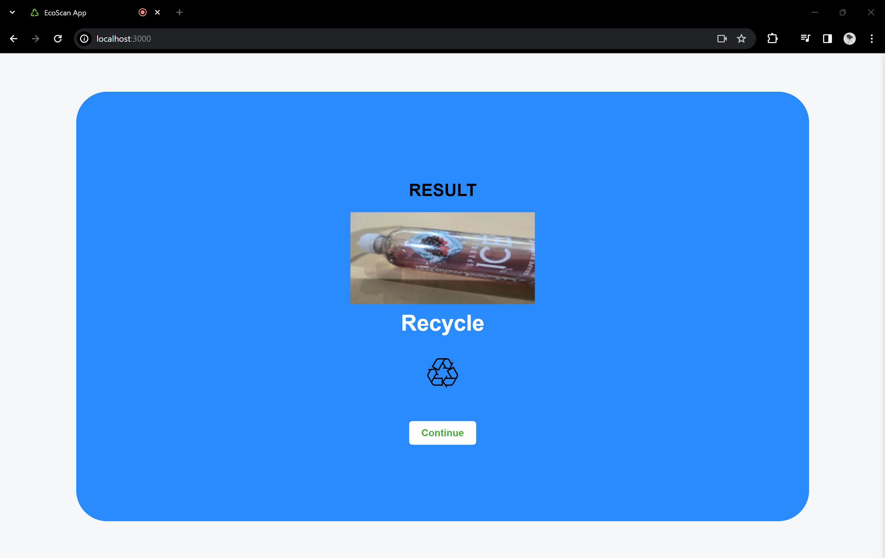

# SFHacks24

### Inspiration
In our campus, we have many recycle bins, some of them come with three (green one, blue one and black one). We got confused what recycle bin we should place our unused item in. Some recycle bin has photo descriptions on it to describe certain types of items, but most it is time-consuming to identify it. That is the work that AI tools can help us. ![alt text] https://photos.google.com/album/AF1QipNbl9grr3LziUgsYs_wtuCuFxwpJpr8-9T44OLo

### What it does
The app allows user to take a photo of a ready to toss item, sort it to four categories: compost (green recycle bin), recycle (blue recycle bin), landfill (black recycle bin) and other (cannot be recycled).

### How we built it
We develop a web that can open front camera(default) and back camera that can snap photo.
We use node.js to develop the server that can call FireLLaVA-13B API and give response.
We integrate the front-end website, back-end server and API fetch.
We design the UI of the frond-end website.

### Challenges we ran into
First time Hackathon experience
Some emergency happens, so two of your original teammates cannot attend. So, our group has only two members.
First time we work with AI API, so it takes some time to figure it out.

### Accomplishments that we're proud of
Finish the main part of our project (from idea to prototype to optimism) within 24 hours!
First time to use AI API!
Proud of our UI design!

### What we learned
Don't give up.
Ask for help and suggestions.
Teamwork and networking.

### What's next for EcoScan app
Train a more specialized model to recognize and sort multiple items in one photo and increase accuracy.
Develop a scanner, build on the recycle bin so that user can scan the item and then put it correct recycle bin.
Deploy the app, and test in mobile devices.

### Built With
HTML, CSS, JavaScript, Node.JS, FireLLaVA-13b APIs

### After the Hackathon
I'm working on a real-time multi-object detection project for trash classification. I fine-tuned the YOLOv5 model using the open-source TACO dataset, which is specialized in detecting trash-related objects. The trained model performs well in identifying specific items like packages and bottles but struggles with food leftovers and more general waste.

To address this, I mapped YOLOv5's 80 classes into four broader categories to provide a more generalized classification. I then pipelined the two models, combining their results to improve overall detection accuracy.

Picture 1 shows the results of the fine-tuned YOLOv5 model, while Picture 2 demonstrates the effect of the class mapping approach.

